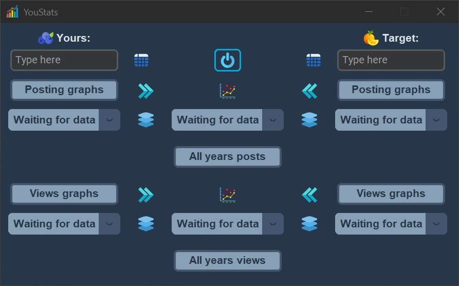
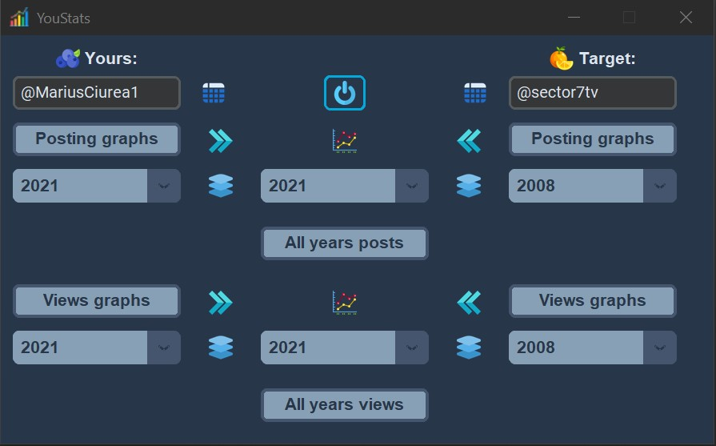
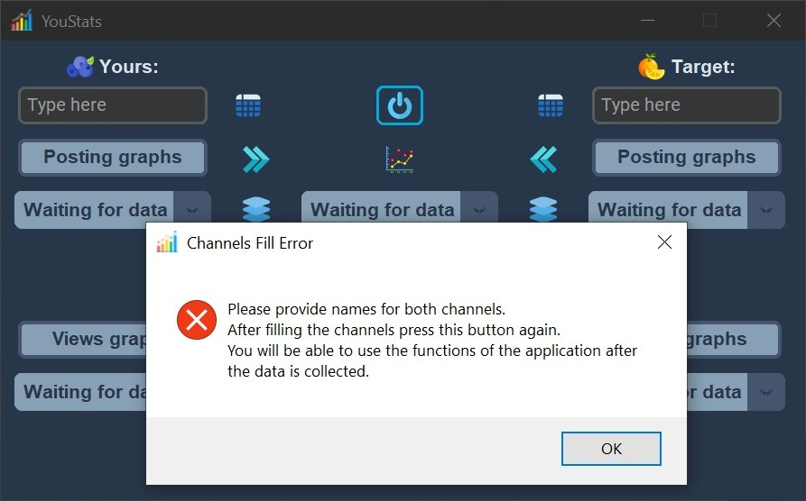
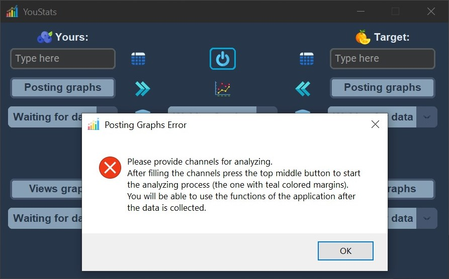
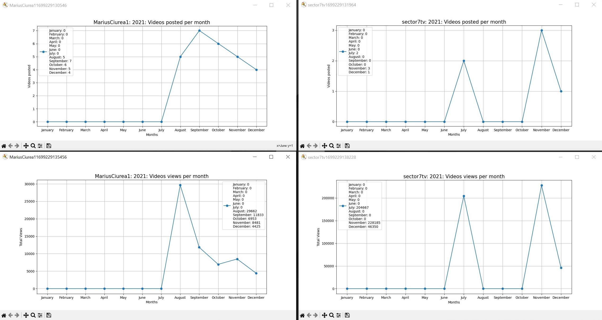
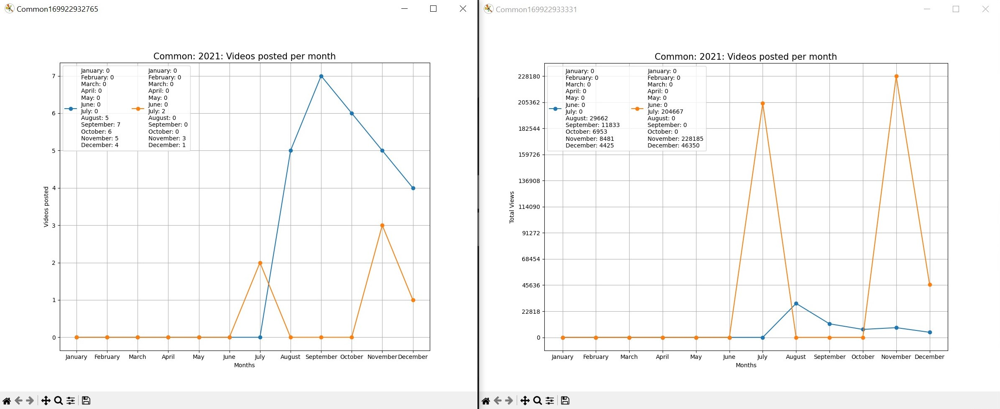

# YouStats

YouStats is a tool for scraping data from two YouTube channels, comparing their growth over the years, and visualizing common information. You can export channel data to CSV files, generate graphs, and compare channel activities.

## Screenshots

    Application functionalities are locked if no data is provided. 
     
    
    

     Application will also display error windows if the user tries to access the buttons without providing data by starting the analysis process. 
     
    
    

     Get the graphs in all shapes and forms suited for the data analysis. 
     
    
    

## YouTube presentation

## Features

- Scrap data from YouTube channels.
- Compare channel or channels growth.
- Export data to CSV files.
- Generate graphs for channel or channels activity.
- Compare channel or channels activities.

## Usage

To use YouStats, follow these steps:

1. Open the program
2. Start the process of web scarping after providing the channels
3. Wait for data retrieval
4. Generate graphs and CSV files

## Major used modules/ packages

- Custom Tkinter
- Selenium
- Matplotlib
- Plotly

Note: Project is made using 'Python 3.12.0'

## Installation guide

1. Open CMD and navigate to the desired path where the project will be located:
> cd /path/to/your/desired/directory

2. Clone the repository:
> git clone https://github.com/edg96/YouStats.git

3. Create the virtual environment
> python -m venv venv

4. Navigate to into the project directory:
> cd YouStats

5. Activate the virtual environment:

   - Windows:
     > venv\Scripts\activate

   - MacOS/Linux:
     > source venv/bin/activate

6. Install the necessary packages and modules from the requirements.txt:
> pip install -r requirements.txt

7. Run the main.py file and enjoy the application

## License

This project is not under any specific license. It is open for public use and modification. You are free to use, modify, and distribute the code as you see fit. I look forward for any contributions, suggestions and improvements.

Please note that while this project is open for public use, some third-party dependencies or components might be under certain license agreements.

To check the project dependencies in detail, please read the requirements text file provided in the project.

## Credits

Author: Dragos-Gabriel Enache

Maintainer: Dragos-Gabriel Enache

Email: edragosgabriel@gmail.com

GitHub: https://github.com/edg96

Status: Development temporary suspended. Unit tests are not finished.
